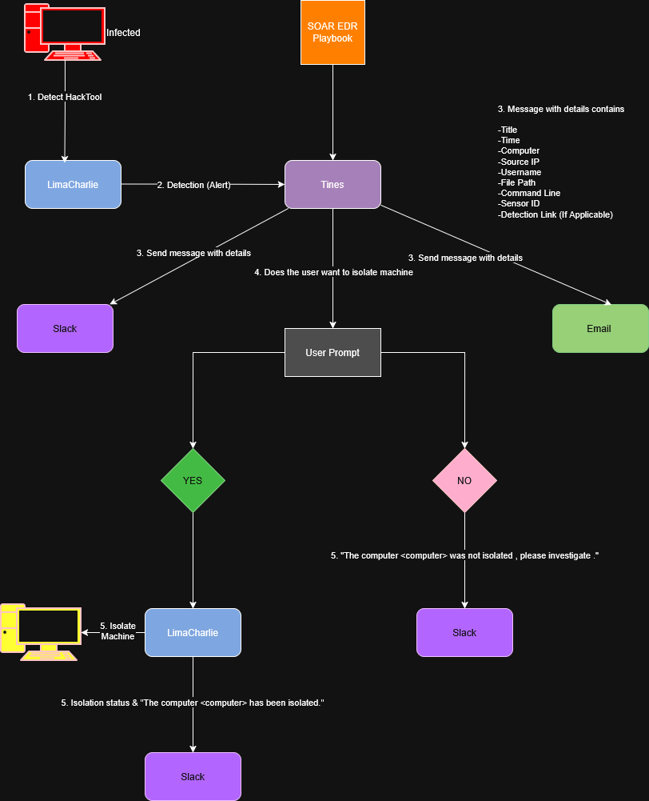
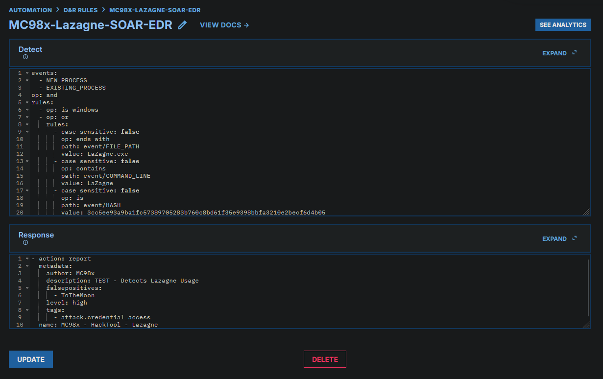
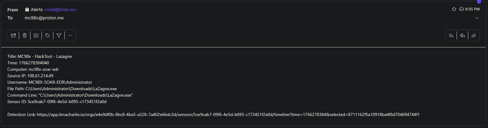
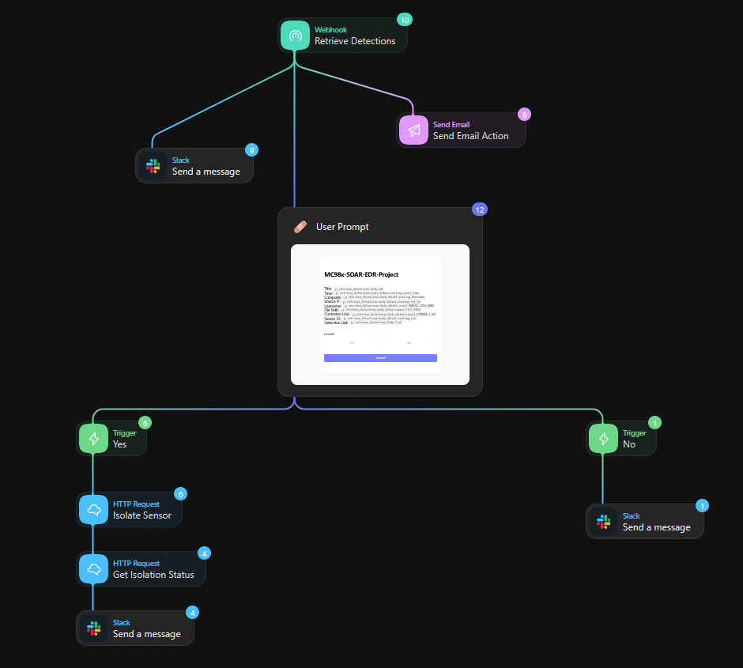
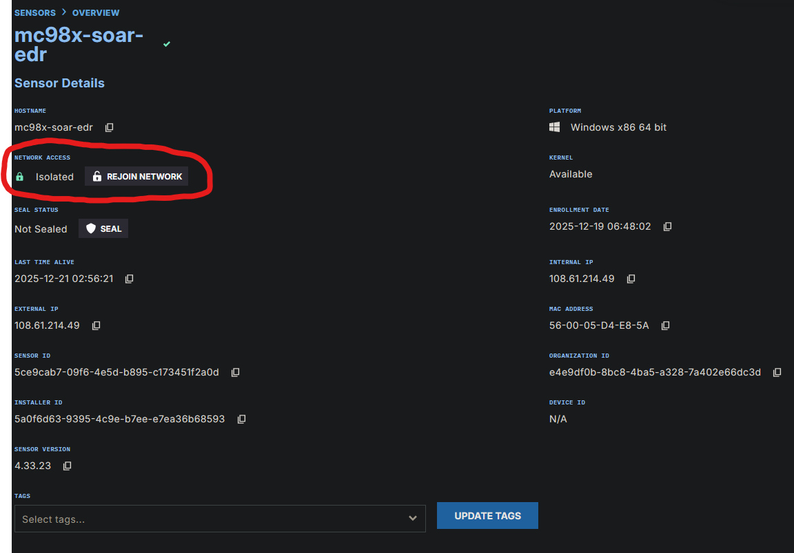
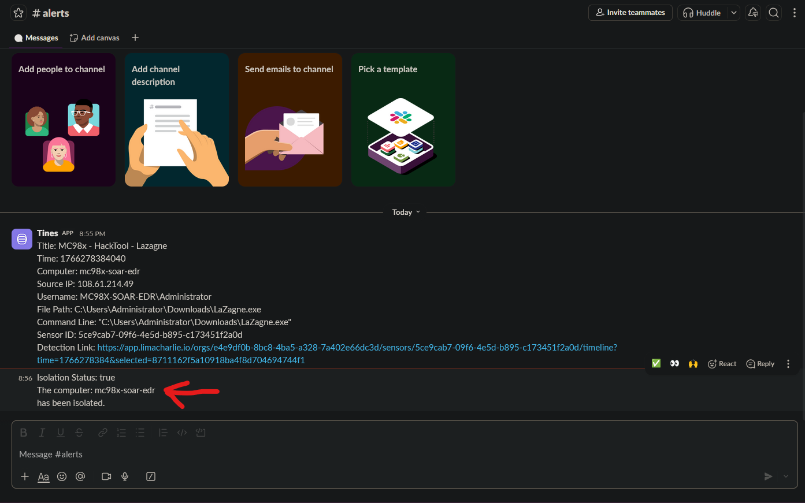

# SOAR EDR Project

### Objective
The objective of this project was to create a detection and response pipeline by integrating a **Security Orchestration, Automation, and Response (SOAR)** platform with an **Endpoint Detection and Response (EDR)** solution. The goal was to simulate a real-world SOC scenario where a specific threat (Credential Access via LaZagne) is detected on an endpoint, and the response process—including analyst notification and containment—is automated to reduce response time.

This project focused on:
* Deploying an EDR agent (**LimaCharlie**) to a cloud-based Windows endpoint.
* Generating telemetry by simulating a credential dumping attack using **LaZagne**.
* Writing a custom **Detection & Response (D&R)** rule to identify the malicious activity.
* Building an automated playbook in **Tines** to alert analysts via Slack and Email.
* Implementing a "User-in-the-Loop" mechanism to allow analysts to authorize machine isolation remotely.

---

### Skills Learned

**I. Detection Engineering & EDR Management:**
* **EDR Deployment:** Installed and configured the **LimaCharlie** EDR agent on a Windows Server instance hosted in the cloud (**Vultr**) to gain deep visibility into endpoint processes and network activity.
* **Custom Rule Creation:** Authored a granular Detection & Response (D&R) rule in LimaCharlie to detect the usage of **LaZagne** based on file paths, process names, and command-line arguments (e.g., `lasagna.exe all`).
* **Telemetry Analysis:** Analyzed process trees and event logs (Process Creation) to identify specific Indicators of Compromise (IOCs) needed for high-fidelity detection.

**II. Security Orchestration, Automation, and Response (SOAR):**
* **Playbook Design:** Designed a logical workflow in **Tines** to handle the incident lifecycle: Detection Ingestion -> Analyst Notification -> Decision Making -> Automated Response.
* **API Integration:** Configured **Webhooks** to send alerts from LimaCharlie to Tines and utilized the **LimaCharlie API** within Tines to execute containment actions (Sensor Isolation).
* **Human-in-the-Loop Decisions:** Created a dedicated **User Prompt Page** in Tines that allows a SOC analyst to approve or deny an isolation request via a simple web interface.

**III. Communication & Reporting:**
* **Automated Alerting:** Configured the SOAR playbook to parse JSON data from the alert and format a readable message sent to a dedicated **Slack** channel and **Email**.
* **Cross-Platform Integration:** Established secure connections between the EDR, SOAR platform, and communication tools (Slack) to ensure seamless data flow.

---

### Tools Used

**Security Stack:**
* **LimaCharlie:** EDR (Endpoint Detection and Response) & Control Plane.
* **Tines:** SOAR (Security Orchestration, Automation, and Response) Platform.
* **Slack:** Incident Alerting & Communication.

**Infrastructure & Environment:**
* **Vultr:** Cloud Service Provider (Windows Server Instance).
* **Windows Server 2022:** Target Endpoint.
* **LaZagne:** HackTool (Used for Password Recovery/Credential Dumping simulation).

**Utilities:**
* **Draw.io:** Workflow Diagramming.
* **SquareX:** Disposable Email for testing alerts.

---

### Network Diagram

*The following diagram illustrates the logical flow of the SOAR pipeline: from the initial detection of a hacktool on the infected endpoint to the automated distribution of alerts and the final execution of isolation commands based on analyst input.*

---

### Key Results

**1. High-Fidelity Threat Detection**
Successfully created a custom D&R rule in LimaCharlie that instantly detected the execution of `lazagne.exe` with the argument `all`. This proved the ability to move beyond default signature sets and write logic for specific threats.

**2. Automated Analyst Notification**
Eliminated the need to constantly monitor the EDR console. Within seconds of the attack execution, Tines received the webhook event and sent a formatted alert to **Slack** and **Email** containing critical context:
* **Time of Event**
* **Computer Name & User**
* **Source IP**
* **Process Command Line**
* **Direct Link to EDR Console**

**3. One-Click Containment (Response)**
Implemented a seamless response workflow. Instead of manually logging into the EDR to isolate the host, the analyst receives a prompt.
* **Scenario:** Analyst receives Slack alert -> Clicks "Investigate" link -> Reviews details on Tines Prompt Page -> Selects "Yes, Isolate".
* **Outcome:** Tines automatically triggers the LimaCharlie Isolation API, severing the device's network connection to prevent lateral movement.

---

### Screenshots

#### 1. Detection Engineering (The Rule)
*I configured a custom Detection & Response (D&R) rule within LimaCharlie. As shown, the rule is designed to flag activity based on the File Path, Command Line arguments, or the specific SHA256 hash associated with the LaZagne hacktool. This multi-layered approach ensures detection even if the file is renamed.*

#### 2. Multi-Channel Alerting (Slack & Email)
*Speed is critical in a SOC. The Tines playbook immediately broadcasts the detection to both Slack and Email. These alerts contain high-context metadata—including the Sensor ID and a direct link to the LimaCharlie timeline—enabling the analyst to begin triage instantly.*

#### 3. The Playbook (Tines Workflow)
*This is the logic engine behind the project. The Tines storyboard handles the ingestion of the EDR webhook and executes the branching logic: alerting, waiting for a user decision, and then executing the response or notifying the team of a 'No' decision.*

#### 4. Human-in-the-Loop Response (User Prompt)
*To prevent accidental disruption of business operations, the playbook pauses for analyst authorization. I created a dedicated prompt page where the analyst can review the telemetry one last time before committing to host isolation.*

#### 5. Response Confirmation (Isolation & Slack Update)
*Once 'Yes' is selected, the LimaCharlie sensor is moved into an isolated state (as seen in the Network Access status). To close the loop, Tines sends a final confirmation back to Slack. In this simulation, the time from detection (8:55 PM) to isolation (8:56 PM) was only **one minute**.*

---

### Future Improvements
To expand the capabilities of this project and mirror a mature SOC environment, the following improvements are planned:

* **False Positive Handling:** Incorporate logic in the Tines playbook to check if the executable is signed or is located in a known "admin tools" directory before alerting, reducing noise.
* **Threat Intelligence Integration:** Automatically query the file hash against **VirusTotal** or **Hybrid Analysis** within the Tines story and include the reputation score in the initial Slack alert.
* **Case Management:** Integrate a ticketing system (like **Jira** or **TheHive**) to automatically create an incident ticket when a user chooses to isolate the machine, ensuring an audit trail.
* **Broader Response Actions:** Add options to the user prompt for other actions, such as "Kill Process" or "Get System Info," rather than just "Isolate."

---

### Conclusion
This SOAR EDR project demonstrated the power of integrating detection capabilities with automated response workflows. By bridging **LimaCharlie** and **Tines**, I moved from a passive monitoring stance to an active, automated defense posture.

This project validated my ability to:
1.  **Engineer Detections:** Write custom logic to catch specific attacker tools.
2.  **Automate Operations:** Reduce the "Time to Acknowledge" and "Time to Respond" metrics significantly using SOAR.
3.  **Manage Security Infrastructure:** Configure cloud-based EDR sensors and manage their connectivity.

These skills are directly transferable to a **SOC Analyst** role, where speed, accuracy, and process efficiency are paramount.

---

### Resources and Documentation
To review the full build process and configuration details

* **Complete Process Screenshots:** [Full Screenshot Process](./Full-Screenshot-Process)
